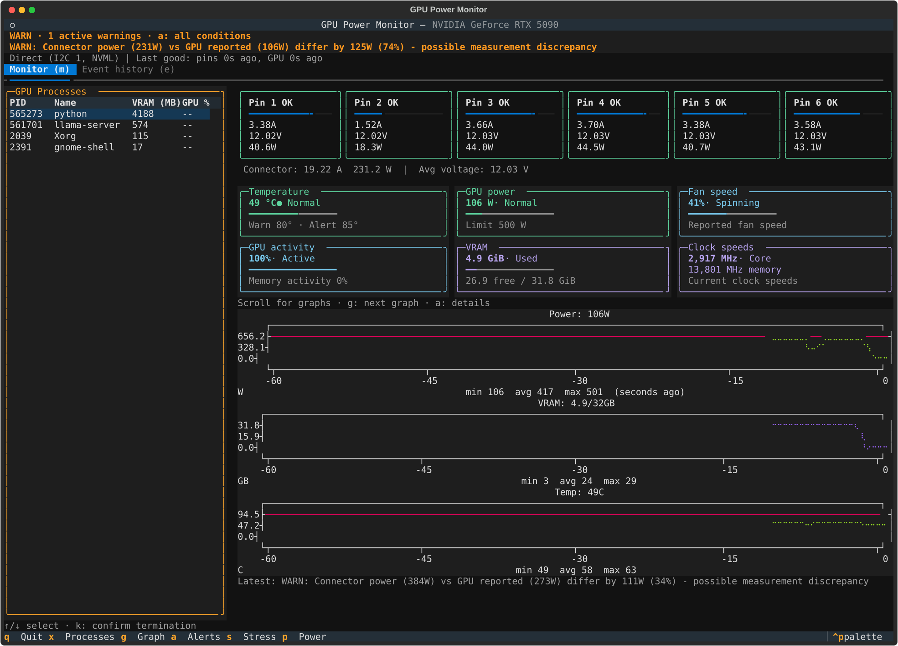

# GPU Power Monitor

[](https://www.python.org/)
[](https://github.com/senorcris/gpu-power-monitor)
[](LICENSE)

**Track the power draw on each pin of your GPU's 12V-2x6 connector.**

GPU Power Monitor is a Linux terminal dashboard for NVIDIA GPUs. On supported ASUS ROG cards, it reads voltage and current from all six 12V power pins through the onboard IT8915FN controller. It also pulls in the usual NVML stats, including total power, temperature, clocks, utilization, VRAM, and running processes.

If your card does not expose per-pin data, the NVML dashboard still works.



Live dashboard on an RTX 5090. Metric panels and pin gauges reflow in narrower terminals.

## Why per-pin readings are useful

`nvidia-smi` reports the GPU's total power draw. It cannot tell you when one connector contact is carrying more current than the others.

A 12V-2x6 connector has six +12 V contacts. Each one is rated for 9.2 A, so a loose or poorly seated connection matters on a high-power card. This tool gives you a closer look at how the load is distributed.

- Voltage, current, and calculated power for each pin
- Color-coded gauges based on per-pin current thresholds
- Connector input power compared with NVML power readings
- Rolling power, VRAM, and temperature graphs at 2 Hz
- Alerts for unusual current, voltage, power, and temperature
- GPU process monitoring and power-limit controls
- Optional PyTorch stress tests
- JSON output and an NDJSON Unix-socket daemon

ASUS offers similar per-pin readings through Power Detector+ on Windows. This project brings that data to Linux.

## Hardware support

| Feature | Support |
| --- | --- |
| Per-pin 12V-2x6 readings | Verified on the ASUS ROG Astral RTX 5090 LC with IT8915FN |
| Other ASUS ROG cards with IT8915FN | May work, but still need testing |
| Standard GPU stats | NVIDIA GPUs supported by the proprietary driver and NVML |
| AMD and Intel GPUs | Not supported |

Per-pin support depends on the card's board design and firmware. A 12V-2x6 connector by itself does not mean the readings are available. Other vendors may use a different controller or keep this data private.

If the probe works on your card, please open a [hardware support report](https://github.com/senorcris/gpu-power-monitor/issues) with the model and PCI subsystem ID.

## Install

You will need Linux, Python 3.11 or newer, a working NVIDIA proprietary driver, and [`uv`](https://docs.astral.sh/uv/).

```bash
git clone https://github.com/senorcris/gpu-power-monitor.git
cd gpu-power-monitor
uv sync
uv run gpu-power-monitor
```

The connector panel stays hidden if the app cannot open the I2C controller. The rest of the dashboard continues to work through NVML.

## Enable per-pin readings

Check whether Linux exposes the I2C devices, then probe the NVIDIA adapters.

```bash
ls /dev/i2c-*
uv run gpu-power-monitor --probe
```

I2C access usually requires root or membership in the `i2c` group.

```bash
sudo usermod -aG i2c "$USER"
```

Log out and back in after changing group membership. Some distributions may also need a udev rule. Use group or udev permissions instead of running the whole dashboard as root.

A successful probe prints six sensible voltage and current pairs. If it finds the controller on another bus, pass that bus when starting the app.

```bash
uv run gpu-power-monitor --bus 3
```

The known protocol uses address `0x2b`, register `0x80`, and a 24-byte read. You can override those settings while testing other hardware.

```bash
uv run gpu-power-monitor --bus 3 --address 0x2b --register 0x80
```

> [!CAUTION]
> The monitor only reads from I2C, but undocumented GPU buses are still hardware-specific. Check that the values make sense before trusting an alert. This is a diagnostic tool, not a substitute for checking that the cable is fully seated and undamaged.

## Usage

```bash
# Open the terminal dashboard.
uv run gpu-power-monitor

# Print one JSON snapshot.
uv run gpu-power-monitor --once

# Probe NVIDIA I2C adapters.
uv run gpu-power-monitor --probe

# Run the NDJSON daemon in the foreground.
uv run gpu-power-monitor --daemon

# List every option.
uv run gpu-power-monitor --help
```

The daemon listens on `/run/user/$UID/gpu-power-monitor.sock`. The dashboard connects to it when available. Otherwise, it reads the hardware directly.

The Monitor tab shows all six pin gauges and the power, VRAM, and temperature
history graphs. At 140 columns or wider, the process list stays on the left;
in narrower windows, use the Processes tab (`x`). Gauges adapt to the remaining
monitor width. All three history graphs remain available at every terminal size.
Pin gauges reflow into six, three, two,
or one column as the terminal narrows. Scroll in shorter windows, or press `g`
to jump to the next graph. The health
summary stays visible on every tab. Event history records conditions starting,
changing severity, and resolving; clearing history does not clear active warnings.

The source line shows when each sensor last returned a reading. Missing readings
are retried automatically. Press `a` for the current conditions, failure details,
thresholds, and connection guidance.

Temperature, GPU power, fan speed, GPU activity, VRAM, and clock speeds have
compact readout panels that reflow into three, two, or one column. Temperature
and power use the GPU profile's warning and alert colors; fan/activity meters
are blue, and memory/clocks are lavender. Power shows the current limit, VRAM
shows free capacity, and stale or unavailable readings switch to neutral panels.

### Keyboard controls

| Key | Action |
| --- | --- |
| `q` | Quit |
| `m` | Show Monitor |
| `x` | Show Processes |
| `e` | Show Event History |
| `g` | Jump to the next power, VRAM, or temperature graph |
| `a` | Show active conditions, thresholds, and connection details |
| `r` | Clear event history; active warnings remain visible |
| `s` | Open stress-test presets and check PyTorch/CUDA readiness |
| `p` | Change the GPU power limit. This requires NVIDIA permissions |
| `k` | In Processes, terminate the named process with SIGTERM. Press twice to confirm |

### Stress tests

Stress tests are optional and require CUDA-enabled PyTorch in the same Python
environment as GPU Power Monitor. Start stays disabled if PyTorch or CUDA is
unavailable. A readiness check runs when the dialog opens; it does not start a workload.

For a project checkout, run `uv run --with torch gpu-power-monitor`.
For a `uv tool` installation from a checkout, use:

```bash
uv tool install --force --with torch .
```

Run that command from this repository. Choose a PyTorch build compatible with your
NVIDIA driver. Tests report Starting, Running, Completed, Stopped, or Failed, and
failure details remain in Event History. Quit also stops tests launched by this app.

## How it works

On the tested ASUS card, the IT8915FN controller appears on an NVIDIA I2C adapter. The app reads 24 bytes from register `0x80` at address `0x2b`.

```text
6 rails x 4 bytes
Each rail contains uint16 voltage_mV and uint16 current_mA in big-endian order
```

Rail 0 maps to pin 6, and rail 5 maps to pin 1. The app multiplies voltage by current for each pin, then adds the six results to get connector input power.

```text
IT8915FN over I2C -> six pin readings --+
                                           +-> snapshot -> TUI, JSON, or daemon
NVIDIA NVML --------> GPU and processes --+
```

Connector input power and NVML power come from different measurement points, so the numbers will not match exactly. The app warns when they differ by more than 20 percent under load.

The default alerts cover the following conditions.

- Pin current above 7.5 A for a warning or 9.2 A for an alert
- Pin voltage outside 10 to 13 V
- Model-specific power and temperature limits for RTX 50-series cards
- A connector and NVML power difference above 20 percent when both exceed 50 W

## Test another card

Open an [issue](https://github.com/senorcris/gpu-power-monitor/issues) and include the following details.

- The GPU manufacturer and exact model
- Your Linux distribution, kernel, and NVIDIA driver version
- PCI IDs from `lspci -nn -v -d 10de:`
- Sanitized output from `uv run gpu-power-monitor --probe`
- Whether the readings stay sensible at idle and under load

Do not write to unknown I2C registers while looking for a controller. New hardware support should start with documented or independently checked read-only behavior.

## Development

```bash
uv sync
uv run pytest
```

Contributions are welcome. Card reports, controller research, safer detection, packaging, documentation, and tests are all useful. Keep hardware access mockable so the test suite can run without an NVIDIA GPU.

## License

[MIT](LICENSE)
